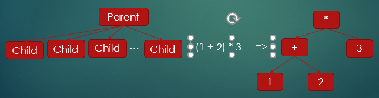

# Xgl - Xg Integration Language

## Introduction

Xgl is the integration language used by the Xg Game Engine.  It is a free format language that resembles "c-Language" and "Java" syntax.  

Xgl is not a compiled or interpreted language, but is translated into a node-based structured that can be executed.  The node-based structure can actually be created by either translating the Xgl code or programmatically by invoking the correct library classes to build the node-based structure.  The diagram below is a representation of the node-based structure.  Each node in the structure can have “n” number of children.  The number of children is defined by the purpose associated with the node.  



## First Program - Hello World

The first program that we will execute is the proverbial "Hello, World."

```
program;
  print "Hello, World!";
end;
```
This program uses three Xgl commands to print the text "Hello, World" to the console.  The first line, defines the program.  The second line actually executes the text printing.  The third line, ends the program.  All basic Xgl programs start with this basic structure.  

## Variables 

Xgl supports standard variable names.  All variable names must begin with a letter, either "a" through "z" or "A" through "Z".  The name can then contain, numbers "0" through "9", or an "_".  Any other characters are not allowed.  Variables in Xgl are **not** case sensitive.  Therefore, the variables *CAR*, *car*, *Car*, *caR* are all equal and will reference the same variable.  Keywords are not allowed to be used as variables, these are concidered reserved words and should only be used as commands and sub-commands.

Examples of legal variable names:

```
Priority1
start
two_weeks
```

## Types

Xgl supports four native types by use of the following keywords:

- integer - Defined as a c++ long type
- real - Defined as a c++ double type
- string - Defined as a c++ string type
- boolean - Defined as a c++ bool type

## Type Conversions

Xlg carries out data type conversions in its expression evaluation and assign statements.  In any given binary expression, the type of the expression is determined by the type of the left-hand value.

```
1) 123.45 * 34 => 4197.3
2) 34 * 123.45 => 4182
```

In the example above, the print result of these two expression are very different.  In the first example, the left-hand value is real.  Therefore, in executing the expression the right-hand value is converted to real.  But in the second example, the left-hand value is integer.  There the right-hand value is converted to integer before executing the expression.

```
1) 123 + '456' => 579
2) '456' + 123 => '456123'
```

In the two examples above, Xgl allows for the mixing of string and non-string types.  In the first example, the left-hand value is an integer.  Therefore the right-hand value is converted from an  string to an integer before the addition operator is executed.  In the second example, the plus operator is concatenating to left-hand and right-hand values.  Since the left-hand value is a string, the right-hand value is converted to a string before the concatenation is executed.

## Constants

Xgl allows for the declaration of constant values.  Constants are considered variables that have values that can not change during the execution of the program.  Constants are set once, when they are declared.  If they are used on the left side of an assignment statement it is considered a syntax error.

```
const
  integer MAX_VALUE = 100,
  real PI = 3.145,
  string SIGN = 'STOP',
  boolean OVER_FLOW = true;
	
const integer FEVER = 100;
const NUMBER_POINTS = 2;
```

## Scope Rules

Xgl variables only have scope within the bounds that the variable was created.  In the example code below, the two variables "a" only have visibility within there scope and scopes that are within them.  In the example below, the variable "a" can be seen within the outter and inner while loop.  But the variable "b" can only be seen within the inner while loop.

```
while (...);
  integer a;
  ...
  while (...);
    integer b;
    ...
  end;
end;
```

## Conditions

## While Loop

## For Loop

## Functions

## Arrays

Mark-Down Resource
https://www.youtube.com/watch?v=eVGEea7adDM
https://help.github.com/en/github/writing-on-github/basic-writing-and-formatting-syntax
